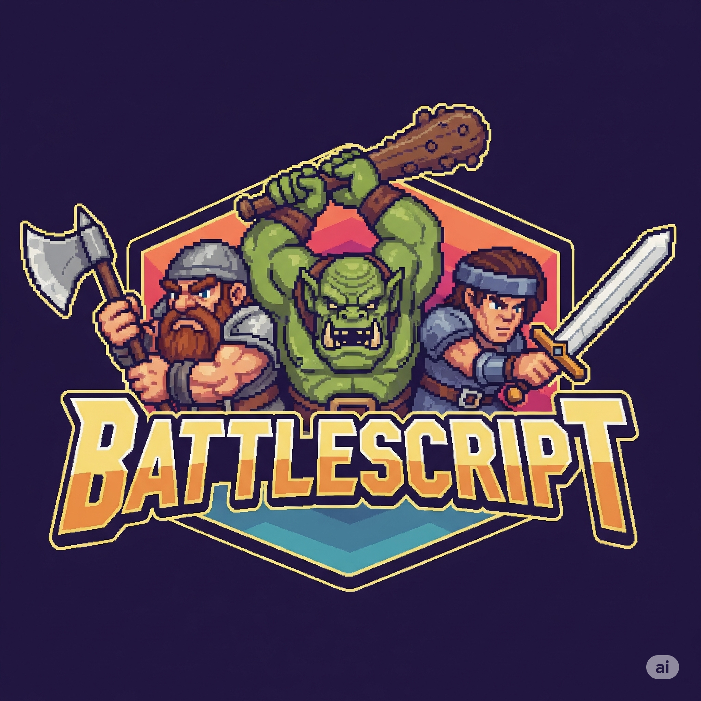

# Battle Scripts

  

## Descrição

**Battle Scripts** é um jogo simples de batalha por turnos onde você escolhe entre três personagens com características distintas para enfrentar inimigos, ganhar batalhas e coletar itens que melhoram suas habilidades. Seu objetivo é avançar o máximo possível derrotando inimigos cada vez mais fortes e aprimorando seu personagem com os itens coletados.

---

  

## Personagens

Você pode escolher um entre três personagens iniciais:

- **Anão**  
  - Vida e força: Baixas  
  - Tendência: Aumenta seus atributos (inteligência, agilidade, etc.) com itens melhores  
  - Estilo: Estratégico e resistente em longo prazo

- **Ogro**  
  - Vida e ataque: Altos  
  - Tendência: Menos inteligente, itens tendem a ser menos eficientes  
  - Estilo: Força bruta, menos tático

- **Humano**  
  - Vida, ataque e inteligência: Equilibrados  
  - Estilo: Meio-termo entre força e inteligência

---

## Como Jogar

1. Escolha seu personagem inicial entre Anão, Ogro ou Humano.
2. Enfrente um inimigo em uma batalha por turnos.
3. Caso vença, escolha um entre três itens oferecidos para melhorar seu personagem.
4. Use seus novos itens para avançar e enfrentar inimigos cada vez mais difíceis.
5. Repita o processo para evoluir seu personagem e conquistar vitórias maiores.

---

## Itens

Após cada vitória, você poderá escolher entre três itens que podem:

- Aumentar sua vida
- Melhorar seu ataque
- Incrementar atributos especiais (inteligência, agilidade, etc.), dependendo do personagem

---

## Objetivo

Sobreviver o maior número de batalhas possível, coletando itens e fortalecendo seu personagem para derrotar inimigos cada vez mais poderosos.

---

## Tecnologias Utilizadas

- **TypeScript** 
- **Express** 
- **HTML5** 
- **CSS3** 
- **JavaScript (ES6+)** 

